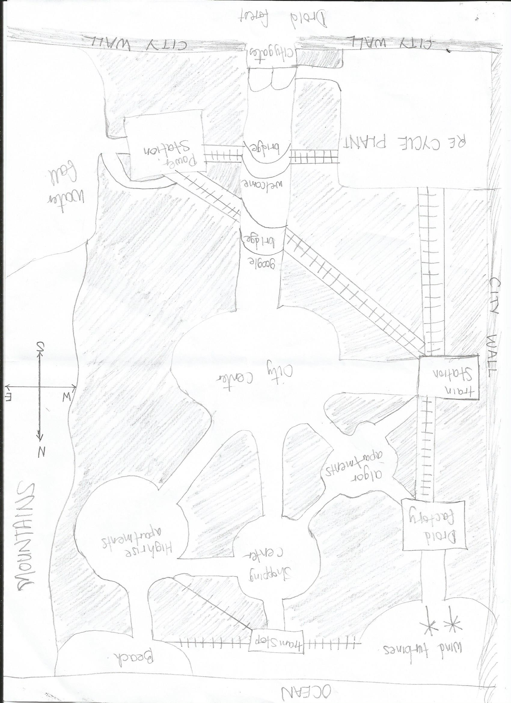
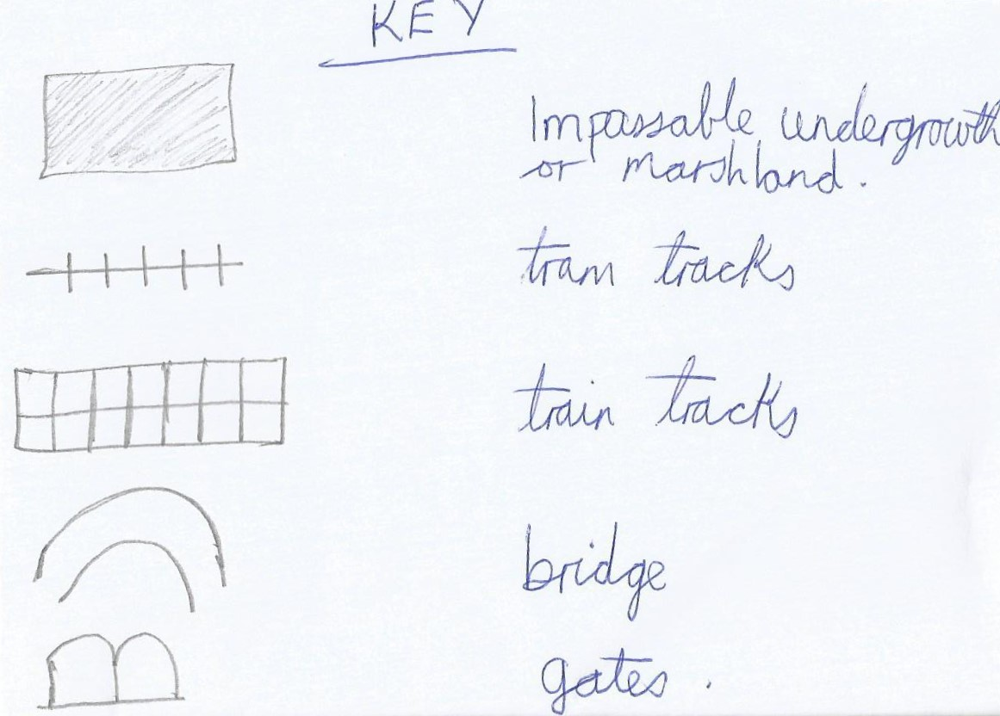

[![LinkedIn][linkedin-shield]][linkedin-url]

 

  <h3 align="center">MY FIRST ADVENTURE GAME.</h3>

  

   A simple text adventure game
     
  

<!-- TABLE OF CONTENTS -->

  
Table of Contents

  <ol>
    <li>
      <a href="#about-the-project">About The Project</a>
      <ul>
        <li><a href="#built-with">Built With</a></li>
      </ul>
    </li>
    <li><a href="#license">License</a></li>
  </ol>

<!-- ABOUT THE PROJECT -->
## About The Project

This console text game was developed as an assignment for a first year module. The text game begins with a back story then prompts the player to choose what they want to do.
To play the game, a player has to answer the questions when prompted.

The text game has ten functions and one class.
Imports: 

The imports included are:
- import sys
- import time
- from map import world_map
- from fuzzywuzzy import process
- from options import actions

#### Player class: 
Initializes a player and is used to store the players location, name and inventory.
#### matcher():
Takes in a word and matches it to the words in the options module and returns a tuple of a word and its match percentage.
#### text_writer(): 
Takes in a string and staggers the text to look like its being written out.
#### welcome_msg(): 
Prompts user for their name and prints out the back story.
#### move():
Takes in a cardinal point and changes the players location to the given cardinal point. Then alerts the player of their new location and its description; as well as the items seen at the current location.
#### direction():
Prompts the player for a direction they would like to take and matches the direction to a cardinal point on the map, which is then passed into the move function.
#### examine():
Lists items that can be examined and describes them.
#### take():
Checks if items can be collected and appends items to players inventory.
#### manage_inv():
Lists all the items in the inventory and lets the player remove items from the inventory.
#### help():
Prints out a help screen with quick instructions.
#### prompt():
Prompts the user for an action they would like to take. Uses if statements to determine what the player has chosen to do. If player enters a command that is not in options then they are prompted to enter something else until a match is found.

### Built With

Built in python

<!-- LICENSE -->
## License

Distributed under the MIT License. See `LICENSE` for more information.

<!-- CONTACT -->
## Contact

Linda Scoon - [@linda_scoon](https://twitter.com/linda_scoon) - Twitter

<!-- MARKDOWN LINKS & IMAGES --> 
[linkedin-shield]: https://img.shields.io/badge/-LinkedIn-black.svg?style=for-the-badge&logo=linkedin&colorB=555
[linkedin-url]: https://www.linkedin.com/in/linda-scoon/
